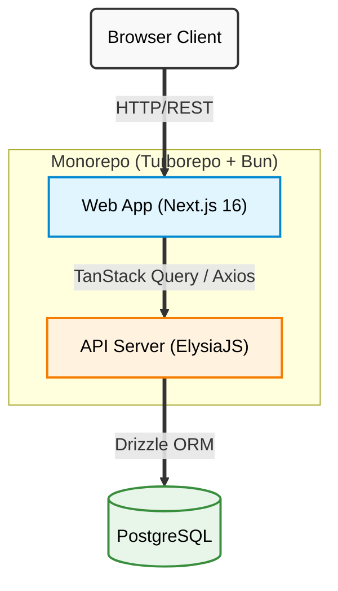

# Task Manager Monorepo

A full-stack Task Manager application built in a [Turborepo](https://turbo.build/repo/docs) monorepo. Features a Next.js frontend, an ElysiaJS backend, and shared tooling packages.

## Live Demo

| Service      | URL                                                                              |
| ------------ | -------------------------------------------------------------------------------- |
| Frontend     | [https://icn.muammar.web.id](https://icn.muammar.web.id/)                        |
| Backend API  | [https://api.icn.muammar.web.id](https://api.icn.muammar.web.id/)                |
| Swagger Docs | [https://api.icn.muammar.web.id/swagger](https://api.icn.muammar.web.id/swagger) |

## What's inside?

### Apps

- **`apps/web`** — A [Next.js](https://nextjs.org/) application with Ant Design, React Query, and WYSIWYG rich text editing.
- **`apps/api`** — An [ElysiaJS](https://elysiajs.com/) backend service with Drizzle ORM, PostgreSQL, JWT auth, and Swagger docs.

### Packages

- **`@repo/eslint-config`** — Shared ESLint configurations.
- **`@repo/typescript-config`** — Shared `tsconfig.json`s used throughout the monorepo.

## Tech Stack

- **Monorepo**: Turborepo, Bun workspaces
- **Frontend**: Next.js 16, React 19, Ant Design 6, TanStack Query 5, Axios, React Quill (WYSIWYG)
- **Backend**: Bun, ElysiaJS, Drizzle ORM, PostgreSQL, JWT, Swagger, Typebox
- **Shared**: TypeScript, ESLint configs
- **Tooling**: TypeScript, ESLint

## Architecture



## Getting Started

### Prerequisites

- [Bun](https://bun.sh/) (package manager and runtime)
- PostgreSQL database (or a hosted service like [Neon](https://neon.tech/))

### Installation

```bash
bun install
```

### Environment Variables

#### Backend (`apps/api/.env`)

```bash
cp apps/api/.env.example apps/api/.env
```

| Variable       | Description                            |
| -------------- | -------------------------------------- |
| `DATABASE_URL` | PostgreSQL connection string           |
| `JWT_SECRET`   | Secret key for signing JSON Web Tokens |

#### Frontend (`apps/web/.env`)

```bash
cp apps/web/.env.example apps/web/.env
```

| Variable              | Description                                             |
| --------------------- | ------------------------------------------------------- |
| `NEXT_PUBLIC_API_URL` | Backend API base URL (default: `http://localhost:3001`) |

### Database Setup

Run Drizzle migrations to set up the database schema:

```bash
cd apps/api
bunx drizzle-kit push
```

### Development

Start all apps in development mode:

```bash
bun run dev
```

This starts:

- **Web** at [http://localhost:3000](http://localhost:3000)
- **API** at [http://localhost:3001](http://localhost:3001)
- **Swagger** at [http://localhost:3001/swagger](http://localhost:3001/swagger)

### Building

```bash
bun run build
```

## Features

- **User Authentication** — Register, login, JWT-based auth
- **Task Management** — Create, read, update, delete tasks
- **Rich Text Editing** — WYSIWYG editor for task descriptions and titles (React Quill)
- **Task Completion** — Toggle tasks as complete/incomplete
- **API Documentation** — Interactive Swagger UI
- **Type Safety** — TypeScript types local to each app, Typebox validation on API
